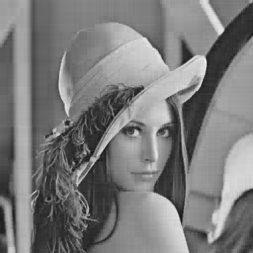
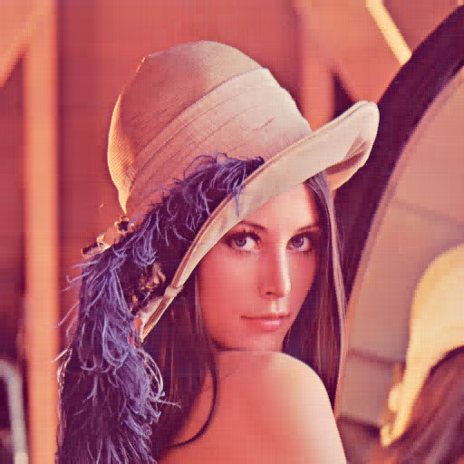
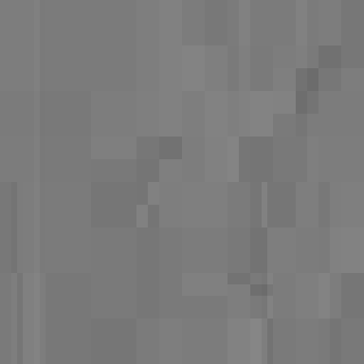

# HsH VC-3: Wavelets for Computer Graphics

This project was developed within the context of the course Visual Computing at Hannover University of Applied Sciences and Arts 
where the third part moderated by Prof. Dr. Dennis Allerkamp was about wavelets for computer graphics.


## Images

Note: All pictures processed here have to have a shape of 2<sup>n</sup> x 2<sup>n</sup>.

Implementation for exercises Images you'll find in `images.py` (resp. `Haar.py`). 
Toggle booleans in `main()` for each subtask.
Commented lines are proposals for different usages of the stated functions.

Three images are provided in list `image_pathes` choose index from [0,2].

1. See file `Haar.py`.

2. 2D Trafo (Decomp-Recon).
	```
	decomp_and_recon_with_steps(image_pathes[1], color=False, normalized=True, standard=False, crop_min_max=False)
	```
	
	Resulting plot contains 4 rows (columns depend on the shape):
	- First row contains the first half of the decomposition (if `standard=True` all rows of the image),
	- Second row contains the second half of the decomposition (if `standard=True` all columns of the image),
	- Reconstruction starts in row three and
	- goes on in row four. The last but one is the reconstructed image.  
	The very last one is a "differences-image" containing the differences between input and reconstructed image (should be black ;)).
	
3. Compression on gray-scale.
	```
	Haar.compression_2d(image_values, number_of_coeffs_left_exact=10000)
	```
	- `squared_error`: Sum of all truncated values will be below this value. Implementing the binar search approach from lecture.
    - `squared_error_stollnitz`: Sum of all truncated values will be below this value. Finding threshold by starting at minimum and doubling each step until squared error is reached.
    - `number_of_coeffs_left_exact`: Exact this amount of coefficients will stay. Searching for the n-th greates element and truncating all below.
    - `number_of_coeffs_left`: Doubling threshold until sum of not truncated coefficients is reached.
    
      
    Lenna compressed down to 10,000 coefficients.
    
4. Same as 3. but for each channel of YUV. Chrominance channel Y is processed with separate values (acc. to 3.).
	```
	Haar.compression_2d_yuv(image_values, y_number_of_coeffs_left_exact=26214, uv_number_of_coeffs_left_exact=13107)
	```
	
	  
	Here 10% of chrominance an 5% of luminance channels (of a 512x512 image).

	File `util.py` contains functions to convert between RGB and YUV.
	
5. IQA Preprocessing.
	```
	preprocessing(image_pathes[2],number_of_coeffs_left_exact=60)
	```
	
	<!---->
	  
	Output of statement above.


## Subdivision

Implementation for exercises 1-3 you'll find in `subdivision.py`.  
Run `main()` to start GUI.

- Subdivision **step** can be changed by slider, 
- Subdivision **scheme** can be chosen from radio buttons.

Implementation for exercises 4 & 5 you'll find in `function_subdivision.py`
- Subdivision **step** can be changed by slider, 
- Subdivision **scheme** can be chosen from radio buttons,
- Functions can be chosen by radio buttons:
	- `function1` is a polynom,
	- `function2` is a sin and
	- `scaling function` is the Kronecker delta. The slider below changes the i of this function.

## Curves

Note: All curves data processed here have to contain exact 2<sup>n</sup>+1 points (since we work on linear B-splines).

Implementation for exercises Curves you'll find in `multi-res.py`.
File `MRAGUI.py` contains the belonging `matplotlib` code, file `curves-data.py` contains `np.arrays` with coordinates.

For `fractional-level` (selected by radio button) there are two "pumping" methods:
- `doubling` and
- `averaging`.

To change the "sweep" of the low-resolution curve, you'll have to choose `discrete` to see points, you can drag over the plot. 
Releasing them will affect the `cur_points` array and further resolution changes will calculate with updated points.

